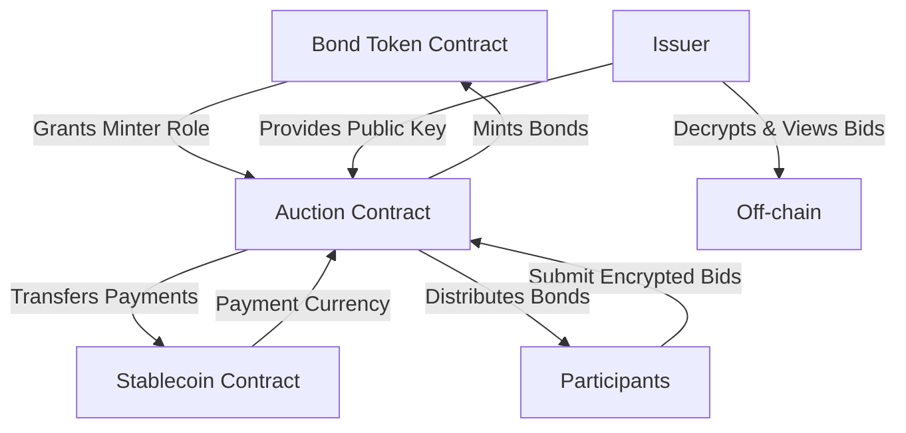

# Phase 1.1: Smart Contract Development

This phase focuses on developing the core smart contracts needed for the on-chain bond auction system. We'll implement three main contracts: the ERC20 bond token, the auction contract with commit-reveal mechanism, and integrate with a stablecoin.

## Overview of Contract Architecture



## 1. ERC20 Bond Token Contract with Minting Capabilities

### Contract: BondToken.sol

```solidity
// SPDX-License-Identifier: MIT
pragma solidity ^0.8.20;

import "@openzeppelin/contracts/token/ERC20/ERC20.sol";
import "@openzeppelin/contracts/access/AccessControl.sol";
import "@openzeppelin/contracts/token/ERC20/extensions/ERC20Capped.sol";

contract BondToken is ERC20, ERC20Capped, AccessControl {
    bytes32 public constant MINTER_ROLE = keccak256("MINTER_ROLE");
    
    // Bond metadata
    uint256 public maturityDate;
    uint256 public faceValue;
    uint256 public couponRate; // Basis points (10000 = 100%)
    
    constructor(
        string memory name,
        string memory symbol,
        uint256 _maxSupply,
        uint256 _maturityDate,
        uint256 _faceValue,
        uint256 _couponRate
    ) ERC20(name, symbol) ERC20Capped(_maxSupply) {
        _grantRole(DEFAULT_ADMIN_ROLE, msg.sender);
        maturityDate = _maturityDate;
        faceValue = _faceValue;
        couponRate = _couponRate;
    }
    
    function mint(address to, uint256 amount) public onlyRole(MINTER_ROLE) {
        _mint(to, amount);
    }
    
    function _mint(address to, uint256 amount) internal override(ERC20, ERC20Capped) {
        super._mint(to, amount);
    }
}
```

### Key Features:
- **ERC20 Standard**: Full compatibility with wallets and DeFi protocols
- **Capped Supply**: Maximum supply set at deployment to match bond issuance
- **Role-Based Access**: Only authorized minters (auction contract) can create tokens
- **Bond Metadata**: Stores maturity date, face value, and coupon rate on-chain

## 2. Auction Contract with Encrypted Bidding for Issuer Visibility

### Contract: BondAuction.sol

```solidity
// SPDX-License-Identifier: MIT
pragma solidity ^0.8.20;

import "@openzeppelin/contracts/access/Ownable.sol";
import "@openzeppelin/contracts/security/ReentrancyGuard.sol";
import "@openzeppelin/contracts/token/ERC20/IERC20.sol";
import "./BondToken.sol";

contract BondAuction is Ownable, ReentrancyGuard {
    // Auction parameters
    uint256 public bondSupply;
    uint256 public minPrice;
    uint256 public maxPrice;
    uint256 public commitDeadline;
    uint256 public revealDeadline;
    uint256 public claimDeadline;
    
    // Issuer's public key for bid encryption (stored as bytes for flexibility)
    bytes public issuerPublicKey;
    
    // Contract references
    BondToken public bondToken;
    IERC20 public paymentToken;
    
    // Auction state
    enum AuctionState { Setup, Commit, Reveal, Finalized, Distributed }
    AuctionState public state;
    
    // Bid structure
    struct Bid {
        bytes32 commitment;          // Hash of bid details for verification
        bytes encryptedBid;          // Bid encrypted with issuer's public key
        uint256 price;               // Revealed price
        uint256 quantity;            // Revealed quantity
        bool revealed;               // Whether bid has been revealed
        uint256 allocation;          // Final allocation
        bool claimed;                // Whether allocation has been claimed
    }
    
    // Bidder data
    mapping(address => Bid) public bids;
    address[] public bidders;
    
    // Auction results
    uint256 public clearingPrice;
    uint256 public totalAllocated;
    
    // Events
    event BidCommitted(address indexed bidder, bytes32 commitment, bytes encryptedBid);
    event BidRevealed(address indexed bidder, uint256 price, uint256 quantity);
    event AuctionFinalized(uint256 clearingPrice, uint256 totalAllocated);
    event TokensClaimed(address indexed bidder, uint256 allocation, uint256 payment);
    event IssuerPublicKeySet(bytes publicKey);
    
    constructor(
        address _bondToken,
        address _paymentToken,
        uint256 _bondSupply,
        uint256 _minPrice,
        uint256 _maxPrice,
        uint256 _commitDuration,
        uint256 _revealDuration,
        uint256 _claimDuration,
        bytes memory _issuerPublicKey
    ) {
        require(_minPrice < _maxPrice, "Invalid price range");
        require(_issuerPublicKey.length > 0, "Invalid issuer public key");
        
        bondToken = BondToken(_bondToken);
        paymentToken = IERC20(_paymentToken);
        bondSupply = _bondSupply;
        minPrice = _minPrice;
        maxPrice = _maxPrice;
        commitDeadline = block.timestamp + _commitDuration;
        revealDeadline = commitDeadline + _revealDuration;
        claimDeadline = revealDeadline + _claimDuration;
        issuerPublicKey = _issuerPublicKey;
        state = AuctionState.Commit;
        
        emit IssuerPublicKeySet(_issuerPublicKey);
    }
    
    // Commit phase: Submit encrypted bid
    // Participants must encrypt their bid details (price, quantity, salt) with the issuer's public key
    function commitBid(bytes32 commitment, bytes calldata encryptedBid) external {
        require(state == AuctionState.Commit, "Not in commit phase");
        require(block.timestamp < commitDeadline, "Commit phase ended");
        require(bids[msg.sender].commitment == bytes32(0), "Bid already committed");
        require(encryptedBid.length > 0, "Invalid encrypted bid");
        
        bids[msg.sender].commitment = commitment;
        bids[msg.sender].encryptedBid = encryptedBid;
        bidders.push(msg.sender);
        
        emit BidCommitted(msg.sender, commitment, encryptedBid);
    }
    
    // Reveal phase: Reveal bid details
    function revealBid(uint256 price, uint256 quantity, uint256 salt) external {
        require(state == AuctionState.Reveal || 
                (state == AuctionState.Commit && block.timestamp >= commitDeadline), 
                "Not in reveal phase");
        require(block.timestamp < revealDeadline, "Reveal phase ended");
        
        // Verify commitment
        bytes32 commitment = keccak256(abi.encodePacked(msg.sender, price, quantity, salt));
        require(bids[msg.sender].commitment == commitment, "Invalid reveal");
        require(price >= minPrice && price <= maxPrice, "Price out of range");
        require(quantity > 0, "Invalid quantity");
        
        bids[msg.sender].price = price;
        bids[msg.sender].quantity = quantity;
        bids[msg.sender].revealed = true;
        
        if (state == AuctionState.Commit) {
            state = AuctionState.Reveal;
        }
        
        emit BidRevealed(msg.sender, price, quantity);
    }
    
    // Get encrypted bid data (useful for issuer monitoring)
    function getEncryptedBid(address bidder) external view returns (bytes memory) {
        return bids[bidder].encryptedBid;
    }
    
    // Additional functions continue...
}
```

## 3. Pro-rata Allocation Logic

### Key Algorithm Implementation:

```solidity
function finalize() external onlyOwner {
    require(state == AuctionState.Reveal || 
            (state == AuctionState.Commit && block.timestamp >= revealDeadline), 
            "Cannot finalize yet");
    
    // Sort bids by price (highest first)
    address[] memory sortedBidders = _sortBiddersByPrice();
    
    uint256 remainingSupply = bondSupply;
    uint256 marginalPrice = minPrice;
    uint256 marginalDemand = 0;
    address[] memory marginalBidders = new address[](bidders.length);
    uint256 marginalBidderCount = 0;
    
    // Find clearing price and allocate non-marginal bids
    for (uint256 i = 0; i < sortedBidders.length; i++) {
        address bidder = sortedBidders[i];
        Bid storage bid = bids[bidder];
        
        if (!bid.revealed) continue;
        
        if (remainingSupply >= bid.quantity) {
            // Full allocation
            bid.allocation = bid.quantity;
            remainingSupply -= bid.quantity;
            marginalPrice = bid.price;
        } else {
            // Marginal bid - need pro-rata allocation
            marginalPrice = bid.price;
            
            // Collect all bids at marginal price
            for (uint256 j = i; j < sortedBidders.length; j++) {
                address marginalBidder = sortedBidders[j];
                Bid storage marginalBid = bids[marginalBidder];
                
                if (marginalBid.revealed && marginalBid.price == marginalPrice) {
                    marginalBidders[marginalBidderCount++] = marginalBidder;
                    marginalDemand += marginalBid.quantity;
                }
            }
            break;
        }
    }
    
    // Pro-rata allocation for marginal bids
    if (marginalDemand > 0 && remainingSupply > 0) {
        for (uint256 i = 0; i < marginalBidderCount; i++) {
            address bidder = marginalBidders[i];
            Bid storage bid = bids[bidder];
            
            // Pro-rata: (bid_quantity / total_marginal_demand) * remaining_supply
            bid.allocation = (bid.quantity * remainingSupply) / marginalDemand;
        }
    }
    
    clearingPrice = marginalPrice;
    totalAllocated = bondSupply - remainingSupply;
    state = AuctionState.Finalized;
    
    emit AuctionFinalized(clearingPrice, totalAllocated);
}
```

## 4. Stablecoin Integration

### Option 1: Using Existing USDC on Base

```solidity
// For Base Mainnet
address constant USDC_BASE = 0x833589fCD6eDb6E08f4c7C32D4f71b54bdA02913;

// For Base Sepolia (if available, otherwise deploy mock)
address constant USDC_BASE_SEPOLIA = 0x...;
```

### Option 2: Deploy Mock Stablecoin for Testing

```solidity
// SPDX-License-Identifier: MIT
pragma solidity ^0.8.20;

import "@openzeppelin/contracts/token/ERC20/ERC20.sol";

contract MockUSDC is ERC20 {
    constructor() ERC20("Mock USDC", "mUSDC") {
        _mint(msg.sender, 1000000 * 10**6); // 1M USDC (6 decimals)
    }
    
    function decimals() public pure override returns (uint8) {
        return 6;
    }
    
    // Faucet function for testing
    function mint(address to, uint256 amount) external {
        _mint(to, amount);
    }
}
```

## 5. Off-chain Encryption Helper

### JavaScript/TypeScript Helper for Bid Encryption:

```javascript
// utils/encryption.js
const crypto = require('crypto');
const ethers = require('ethers');

class BidEncryption {
    constructor(issuerPublicKey) {
        // Convert hex string to Buffer if needed
        this.issuerPublicKey = Buffer.from(issuerPublicKey.replace('0x', ''), 'hex');
    }
    
    // Encrypt bid data with issuer's public key
    encryptBid(price, quantity, salt) {
        const bidData = {
            price: price.toString(),
            quantity: quantity.toString(),
            salt: salt.toString(),
            timestamp: Date.now()
        };
        
        const plaintext = JSON.stringify(bidData);
        
        // Use RSA-OAEP for encryption
        const encrypted = crypto.publicEncrypt({
            key: this.issuerPublicKey,
            padding: crypto.constants.RSA_PKCS1_OAEP_PADDING,
            oaepHash: 'sha256'
        }, Buffer.from(plaintext));
        
        return '0x' + encrypted.toString('hex');
    }
    
    // Generate commitment hash
    generateCommitment(bidderAddress, price, quantity, salt) {
        const packed = ethers.utils.solidityPack(
            ['address', 'uint256', 'uint256', 'uint256'],
            [bidderAddress, price, quantity, salt]
        );
        return ethers.utils.keccak256(packed);
    }
    
    // Helper function to prepare bid submission
    prepareBid(bidderAddress, price, quantity) {
        const salt = ethers.BigNumber.from(ethers.utils.randomBytes(32));
        const commitment = this.generateCommitment(bidderAddress, price, quantity, salt);
        const encryptedBid = this.encryptBid(price, quantity, salt);
        
        return {
            commitment,
            encryptedBid,
            salt: salt.toString(), // Save for reveal phase
            price,
            quantity
        };
    }
}

// Example usage:
async function submitBid(auction, price, quantity) {
    // Get issuer public key from contract
    const issuerPublicKey = await auction.issuerPublicKey();
    const encryption = new BidEncryption(issuerPublicKey);
    
    // Prepare bid
    const bidData = encryption.prepareBid(
        await signer.getAddress(),
        price,
        quantity
    );
    
    // Submit encrypted bid
    const tx = await auction.commitBid(
        bidData.commitment,
        bidData.encryptedBid
    );
    
    // Store salt securely for reveal phase
    localStorage.setItem('bidSalt', bidData.salt);
    
    return tx;
}
```

### Issuer-side Decryption:

```javascript
// issuer/decryption.js
class IssuerDecryption {
    constructor(privateKey) {
        this.privateKey = privateKey;
    }
    
    // Decrypt bid data
    decryptBid(encryptedBid) {
        const encrypted = Buffer.from(encryptedBid.replace('0x', ''), 'hex');
        
        try {
            const decrypted = crypto.privateDecrypt({
                key: this.privateKey,
                padding: crypto.constants.RSA_PKCS1_OAEP_PADDING,
                oaepHash: 'sha256'
            }, encrypted);
            
            return JSON.parse(decrypted.toString());
        } catch (error) {
            console.error('Failed to decrypt bid:', error);
            return null;
        }
    }
    
    // Monitor and decrypt incoming bids
    async monitorBids(auction) {
        // Listen for BidCommitted events
        auction.on('BidCommitted', async (bidder, commitment, encryptedBid) => {
            console.log(`New bid from ${bidder}`);
            
            const bidData = this.decryptBid(encryptedBid);
            if (bidData) {
                console.log(`Decrypted bid: Price=${bidData.price}, Quantity=${bidData.quantity}`);
                // Store or process bid data as needed
            }
        });
    }
}
```

## 6. Access Control Implementation

### Role Management in Auction Contract:

```solidity
function grantMinterRole() external onlyOwner {
    bondToken.grantRole(bondToken.MINTER_ROLE(), address(this));
}

function setMintingCap() external onlyOwner {
    // Ensure auction can only mint up to bond supply
    require(bondToken.cap() >= bondSupply, "Token cap too low");
}
```

## 7. Deployment Script Example

```javascript
// scripts/deploy-auction.js
const hre = require("hardhat");

async function main() {
    // Generate or load issuer's RSA key pair for bid encryption
    const crypto = require('crypto');
    const { publicKey, privateKey } = crypto.generateKeyPairSync('rsa', {
        modulusLength: 2048,
        publicKeyEncoding: {
            type: 'spki',
            format: 'der'
        },
        privateKeyEncoding: {
            type: 'pkcs8',
            format: 'der'
        }
    });
    
    // Convert public key to hex for storage in contract
    const issuerPublicKeyHex = '0x' + publicKey.toString('hex');
    
    // Deploy Bond Token
    const BondToken = await hre.ethers.getContractFactory("BondToken");
    const bondToken = await BondToken.deploy(
        "Treasury Bond 2025",
        "TB25",
        ethers.parseEther("1000000"), // 1M bonds
        Math.floor(Date.now() / 1000) + 365 * 24 * 60 * 60, // 1 year maturity
        100, // $100 face value
        250 // 2.5% coupon
    );
    
    // Deploy Mock USDC (for testing)
    const MockUSDC = await hre.ethers.getContractFactory("MockUSDC");
    const usdc = await MockUSDC.deploy();
    
    // Deploy Auction with issuer public key
    const BondAuction = await hre.ethers.getContractFactory("BondAuction");
    const auction = await BondAuction.deploy(
        bondToken.address,
        usdc.address,
        ethers.parseEther("100000"), // 100k bonds for auction
        85, // $85 minimum price
        100, // $100 maximum price
        3 * 24 * 60 * 60, // 3 days commit phase
        2 * 24 * 60 * 60, // 2 days reveal phase
        7 * 24 * 60 * 60, // 7 days claim phase
        issuerPublicKeyHex // Issuer's public key for encryption
    );
    
    // Grant minter role to auction
    await bondToken.grantRole(await bondToken.MINTER_ROLE(), auction.address);
    
    console.log("BondToken deployed to:", bondToken.address);
    console.log("MockUSDC deployed to:", usdc.address);
    console.log("BondAuction deployed to:", auction.address);
    console.log("Issuer public key:", issuerPublicKeyHex);
    
    // Save private key securely for issuer (DO NOT store in code in production!)
    console.log("\n⚠️  IMPORTANT: Save this private key securely for decrypting bids:");
    console.log(privateKey.toString('hex'));
}

main().catch((error) => {
    console.error(error);
    process.exitCode = 1;
});
```

## Development Checklist

- [ ] Bond token contract implemented with proper access control
- [ ] Auction contract with complete commit-reveal mechanism
- [ ] Pro-rata allocation algorithm tested and optimized
- [ ] Stablecoin integration completed (USDC or mock)
- [ ] All contracts compile without errors
- [ ] Basic deployment script created
- [ ] Contract interfaces documented

## Next Steps

Once contracts are developed, proceed to [Phase 1.2: Local Testing](./1.2-local-testing.md) to thoroughly test all functionality.