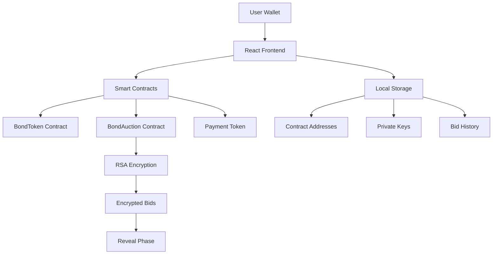

---
# Bond Auction Platform
## Complete User Workflow

A step-by-step guide to creating bonds, auctions, and bidding

<div class="pt-12">
  <span @click="$slidev.nav.next" class="px-2 py-1 rounded cursor-pointer" hover="bg-white bg-opacity-10">
    Press Space for next slide <carbon:arrow-right class="inline"/>
  </span>
</div>

---

# Workflow Overview

The Bond Auction Platform enables:

- **Bond Creation**: Deploy ERC-20 bond tokens with custom parameters
- **Auction Setup**: Create encrypted sealed-bid auctions for bonds  
- **Secure Bidding**: Submit encrypted bids during commit phase
- **Transaction Exploration**: View and analyze all transactions

<v-clicks>

- ✅ **MetaMask Integration** - Seamless wallet connection
- 🔐 **RSA Encryption** - Secure bid privacy until reveal
- 📊 **Real-time Explorer** - Decode events and view bid details
- 💾 **Local Storage** - Track your contracts and bids

</v-clicks>

---

# Step 1: Connect Wallet
*Setting up MetaMask*

<div class="flex items-center justify-center h-96">
  <div class="text-center space-y-4">
    <div class="text-8xl">🦊</div>
    <h2 class="text-2xl font-bold">Connect MetaMask</h2>
    <p class="text-gray-600">Connect your MetaMask wallet to begin interacting with the platform</p>
  </div>
</div>

Make sure you have sufficient ETH for gas fees.

---

# Step 2: Wallet Connected
*Ready to start*

<div class="flex items-center justify-center h-96">
  <div class="text-center space-y-4">
    <div class="text-8xl">✅</div>
    <h2 class="text-2xl font-bold">Wallet Connected</h2>
    <p class="text-gray-600">Your address is now connected and ready to use</p>
  </div>
</div>

The interface shows your current network and account address.

---

# Step 3: Create Bond Token
*Defining bond parameters*

<div class="flex items-center justify-center h-96">
  <div class="text-center space-y-4">
    <div class="text-8xl">🏛️</div>
    <h2 class="text-2xl font-bold">Create Bond Token</h2>
    <div class="text-left space-y-2 mt-4">
      <p>📝 <strong>Name & Symbol</strong>: Token identification</p>
      <p>💰 <strong>Supply & Face Value</strong>: Economic parameters</p>
      <p>📈 <strong>Coupon Rate</strong>: Interest rate</p>
      <p>📅 <strong>Maturity</strong>: Duration in months</p>
    </div>
  </div>
</div>

---

# Step 4: Sign Deployment
*Blockchain transaction*

<div class="flex items-center justify-center h-96">
  <div class="text-center space-y-4">
    <div class="text-8xl">✍️</div>
    <h2 class="text-2xl font-bold">Sign Transaction</h2>
    <p class="text-gray-600">MetaMask prompts you to sign the deployment</p>
  </div>
</div>

Review gas fees and confirm to deploy your bond token contract.

---

# Step 5: Bond Deployed
*Contract successfully created*

<div class="flex items-center justify-center h-96">
  <div class="text-center space-y-4">
    <div class="text-8xl">🎉</div>
    <h2 class="text-2xl font-bold">Bond Token Deployed</h2>
    <p class="text-gray-600">Your bond token contract is live on the blockchain</p>
  </div>
</div>

The contract address is saved locally and displayed with success confirmation.

---

# Step 6: Create Auction
*Setting up the auction*

<div class="flex items-center justify-center h-96">
  <div class="text-center space-y-4">
    <div class="text-8xl">🔨</div>
    <h2 class="text-2xl font-bold">Create Auction</h2>
    <div class="text-left space-y-2 mt-4">
      <p>🏛️ <strong>Bond Token</strong>: Select your deployed bond</p>
      <p>💵 <strong>Price Range</strong>: Min/max bid prices</p>
      <p>⏰ <strong>Timeline</strong>: Commit, reveal, and claim phases</p>
      <p>🔐 <strong>RSA Keys</strong>: Generated for bid encryption</p>
    </div>
  </div>
</div>

---

# Step 7: Deploy Auction
*Creating the auction contract*

<div class="flex items-center justify-center h-96">
  <div class="text-center space-y-4">
    <div class="text-8xl">🚀</div>
    <h2 class="text-2xl font-bold">Deploy Auction</h2>
    <p class="text-gray-600">Sign the transaction to deploy your auction contract</p>
  </div>
</div>

The private key for decrypting bids is securely stored locally.

---

# Step 8: Auction Deployed  
*Ready for bidding*

<div class="flex items-center justify-center h-96">
  <div class="text-center space-y-4">
    <div class="text-8xl">✨</div>
    <h2 class="text-2xl font-bold">Auction Live</h2>
    <p class="text-gray-600">Contract deployed and ready to accept bids</p>
  </div>
</div>

The auction is now live and ready to accept encrypted bids during the commit phase.

---

# Step 9: Choose Auction
*Select auction to bid on*

<div class="flex items-center justify-center h-96">
  <div class="text-center space-y-4">
    <div class="text-8xl">🎯</div>
    <h2 class="text-2xl font-bold">Select Auction</h2>
    <p class="text-gray-600">Browse and choose from available auctions</p>
  </div>
</div>

View auction details including price ranges and deadlines before bidding.

---

# Step 10: Submit Bid
*Encrypted bidding*

<div class="flex items-center justify-center h-96">
  <div class="text-center space-y-4">
    <div class="text-8xl">💰</div>
    <h2 class="text-2xl font-bold">Submit Encrypted Bid</h2>
    <div class="text-left space-y-2 mt-4">
      <p>💵 <strong>Price</strong>: Your bid price per bond</p>
      <p>📊 <strong>Quantity</strong>: Number of bonds to purchase</p>
      <p>🔐 <strong>Encryption</strong>: Bid automatically encrypted with RSA</p>
    </div>
  </div>
</div>

---

# Step 11: Bid Submitted
*Transaction confirmed*

<div class="flex items-center justify-center h-96">
  <div class="text-center space-y-4">
    <div class="text-8xl">🎊</div>
    <h2 class="text-2xl font-bold">Bid Successfully Submitted</h2>
    <p class="text-gray-600">Your encrypted bid is committed to the blockchain</p>
  </div>
</div>

The bid details are saved locally for the reveal phase.

---

# Step 12: Explorer Analysis
*Analyzing transactions*

<div class="flex items-center justify-center h-96">
  <div class="text-center space-y-4">
    <div class="text-8xl">🔍</div>
    <h2 class="text-2xl font-bold">Block Explorer</h2>
    <div class="text-left space-y-2 mt-4">
      <p>📋 <strong>Decode Events</strong>: View human-readable event data</p>
      <p>📊 <strong>Track Transactions</strong>: Monitor all your activities</p>
      <p>🔓 <strong>Reveal Bids</strong>: Decrypt bids with private key</p>
    </div>
  </div>
</div>

---

# Technical Features

<div class="grid grid-cols-2 gap-8">

<div>

## Security
- RSA-OAEP encryption for bids
- Sealed-bid auction mechanism  
- Commitment-reveal scheme
- Local private key storage

</div>

<div>

## User Experience
- React TypeScript frontend
- Real-time transaction tracking
- Automatic event decoding
- Responsive design

</div>

</div>

<div class="pt-8">

## Smart Contracts
- **BondToken.sol**: ERC-20 compliant bonds
- **BondAuction.sol**: Encrypted auction logic
- **MockUSDC.sol**: Payment token for testing

</div>

---

# Architecture Overview



---

# Getting Started

<div class="space-y-6">

## Prerequisites
- Node.js 18+ and npm
- MetaMask wallet
- Local Ethereum node (Hardhat)

## Quick Start
```bash
# Install dependencies
make install

# Start local blockchain
make node

# Deploy contracts  
make deploy-local

# Run frontend
make ui
```

## Testing
```bash
# Run complete workflow test
make auction-test
```

</div>

---

# Thank You!

<div class="text-center space-y-8">

## Bond Auction Platform
**Secure, Transparent, Decentralized**

<div class="flex justify-center space-x-8 pt-8">
  <div class="text-center">
    <div class="text-4xl">🏛️</div>
    <div>Create Bonds</div>
  </div>
  <div class="text-center">
    <div class="text-4xl">🔨</div>
    <div>Run Auctions</div>
  </div>
  <div class="text-center">
    <div class="text-4xl">💰</div>
    <div>Submit Bids</div>
  </div>
  <div class="text-center">
    <div class="text-4xl">🔍</div>
    <div>Explore Data</div>
  </div>
</div>

<div class="pt-8 text-gray-500">
Ready to get started? Connect your wallet and create your first bond!
</div>

</div>