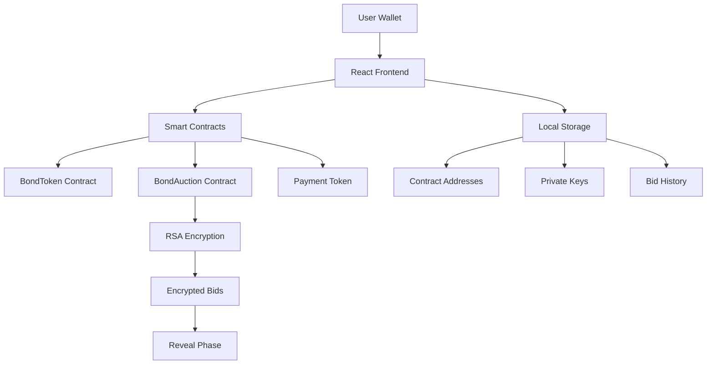

---
# Bond Auction Platform
## Complete User Workflow

A step-by-step guide to creating bonds, auctions, and bidding

<div class="pt-12">
  <span @click="$slidev.nav.next" class="px-2 py-1 rounded cursor-pointer" hover="bg-white bg-opacity-10">
    Press Space for next slide <carbon:arrow-right class="inline"/>
  </span>
</div>

---

# Workflow Overview

The Bond Auction Platform enables:

- **Bond Creation**: Deploy ERC-20 bond tokens with custom parameters
- **Auction Setup**: Create encrypted sealed-bid auctions for bonds  
- **Secure Bidding**: Submit encrypted bids during commit phase
- **Transaction Exploration**: View and analyze all transactions

<v-clicks>

- ✅ **MetaMask Integration** - Seamless wallet connection
- 🔐 **RSA Encryption** - Secure bid privacy until reveal
- 📊 **Real-time Explorer** - Decode events and view bid details
- 💾 **Local Storage** - Track your contracts and bids

</v-clicks>

---

# Step 1: Connect Wallet
*Setting up MetaMask*

<div class="flex items-center justify-center h-96">
  
</div>

Connect your MetaMask wallet to begin interacting with the platform. Make sure you have sufficient ETH for gas fees.

---

# Step 2: Wallet Connected
*Ready to start*

<div class="flex items-center justify-center h-96">
  
</div>

Once connected, you'll see your address and can access all platform features. The interface shows your current network and account.

---

# Step 3: Create Bond Token
*Defining bond parameters*

<div class="flex items-center justify-center h-96">
  
</div>

Configure your bond token with:
- **Name & Symbol**: Token identification
- **Supply & Face Value**: Economic parameters  
- **Coupon Rate**: Interest rate
- **Maturity**: Duration in months

---

# Step 4: Sign Deployment
*Blockchain transaction*

<div class="flex items-center justify-center h-96">
  
</div>

MetaMask will prompt you to sign the deployment transaction. Review gas fees and confirm to deploy your bond token contract.

---

# Step 5: Bond Deployed
*Contract successfully created*

<div class="flex items-center justify-center h-96">
  
</div>

Your bond token is now deployed! The contract address is saved locally and displayed with a success confirmation.

---

# Step 6: Create Auction
*Setting up the auction*

<div class="flex items-center justify-center h-96">
  
</div>

Configure auction parameters:
- **Bond Token**: Select your deployed bond
- **Price Range**: Min/max bid prices
- **Timeline**: Commit, reveal, and claim phases
- **RSA Keys**: Generated for bid encryption

---

# Step 7: Deploy Auction
*Creating the auction contract*

<div class="flex items-center justify-center h-96">
  
</div>

Sign the transaction to deploy your auction contract. The private key for decrypting bids is securely stored locally.

---

# Step 8: Auction Deployed  
*Ready for bidding*

<div class="flex items-center justify-center h-96">
  
</div>

Auction is live! The contract is deployed and ready to accept encrypted bids during the commit phase.

---

# Step 9: Check Logs
*Transaction verification*

<div class="flex items-center justify-center h-96">
  
</div>

View transaction logs to confirm successful deployment. All contract addresses and transaction hashes are tracked.

---

# Step 10: Choose Auction
*Select auction to bid on*

<div class="flex items-center justify-center h-96">
  
</div>

Browse available auctions and select one to bid on. View auction details including price ranges and deadlines.

---

# Step 11: Submit Bid
*Encrypted bidding*

<div class="flex items-center justify-center h-96">
  
</div>

Enter your bid:
- **Price**: Your bid price per bond
- **Quantity**: Number of bonds to purchase
- **Encryption**: Bid is automatically encrypted with RSA

---

# Step 12: Bid Submitted
*Transaction confirmed*

<div class="flex items-center justify-center h-96">
  
</div>

Success! Your encrypted bid is committed to the blockchain. The bid details are saved locally for the reveal phase.

---

# Step 13: Explorer View
*Analyzing transactions*

<div class="flex items-center justify-center h-96">
  
</div>

Use the built-in explorer to:
- **Decode Events**: View human-readable event data
- **Track Transactions**: Monitor all your activities  
- **Reveal Bids**: Decrypt bids when you have the private key

---

# Technical Features

<div class="grid grid-cols-2 gap-8">

<div>

## Security
- RSA-OAEP encryption for bids
- Sealed-bid auction mechanism  
- Commitment-reveal scheme
- Local private key storage

</div>

<div>

## User Experience
- React TypeScript frontend
- Real-time transaction tracking
- Automatic event decoding
- Responsive design

</div>

</div>

<div class="pt-8">

## Smart Contracts
- **BondToken.sol**: ERC-20 compliant bonds
- **BondAuction.sol**: Encrypted auction logic
- **MockUSDC.sol**: Payment token for testing

</div>

---

# Architecture Overview



---

# Getting Started

<div class="space-y-6">

## Prerequisites
- Node.js 18+ and npm
- MetaMask wallet
- Local Ethereum node (Hardhat)

## Quick Start
```bash
# Install dependencies
make install

# Start local blockchain
make node

# Deploy contracts  
make deploy-local

# Run frontend
make ui
```

## Testing
```bash
# Run complete workflow test
make auction-test
```

</div>

---

# Thank You!

<div class="text-center space-y-8">

## Bond Auction Platform
**Secure, Transparent, Decentralized**

<div class="flex justify-center space-x-8 pt-8">
  <div class="text-center">
    <div class="text-4xl">🏛️</div>
    <div>Create Bonds</div>
  </div>
  <div class="text-center">
    <div class="text-4xl">🔨</div>
    <div>Run Auctions</div>
  </div>
  <div class="text-center">
    <div class="text-4xl">💰</div>
    <div>Submit Bids</div>
  </div>
  <div class="text-center">
    <div class="text-4xl">🔍</div>
    <div>Explore Data</div>
  </div>
</div>

<div class="pt-8 text-gray-500">
Ready to get started? Connect your wallet and create your first bond!
</div>

</div>