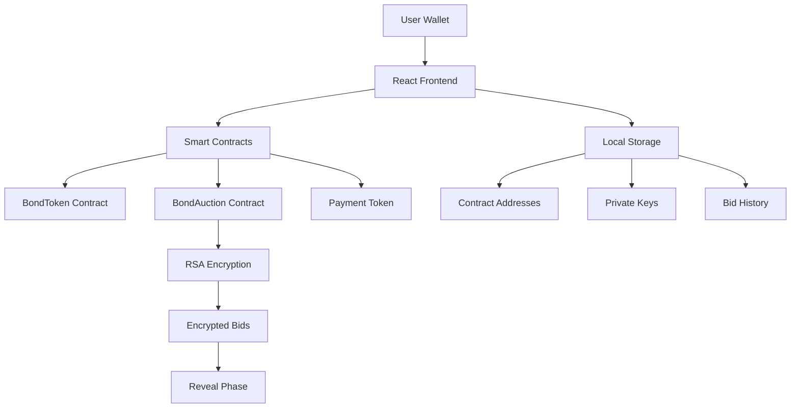

---
# Bond Auction Platform
## Complete User Workflow

A step-by-step guide to creating bonds, auctions, and bidding

<div class="pt-12">
  <span @click="$slidev.nav.next" class="px-2 py-1 rounded cursor-pointer" hover="bg-white bg-opacity-10">
    Press Space for next slide <carbon:arrow-right class="inline"/>
  </span>
</div>

---

# Overview

This Bond Auction application demonstrates:

- **Bond Creation**: A bond smart contract ([BondToken.sol](https://github.com/aaronp/auctions/blob/master/contracts/BondToken.sol))
- **Auction Setup**: An auction smart contract ([BondAuction.sol](https://github.com/aaronp/auctions/blob/master/contracts/BondAuction.sol)) for the bond
- **Secure Bidding**: Allow encrypted bids on the Bond which the issuer can observe
- **A Transaction Exploration**: View and analyze all transactions (basic block explorer)


The webapp is available [here](https://aaronp.github.io/auctions), and the code is [here](https://github.com/aaronp/auctions)

---
layout:default
---
# Step 1: Connect A Wallet
*Connecting a wallet*

<div v-click="1">

This documentation shows the workflow which connects to a locally running ETH network (via [hardhat](https://hardhat.org/hardhat2/redirect?r=%2Fhardhat-runner%2Fdocs%2Fgetting-started#overview))

If you've cloned this project, you can start the network using `make node` to start it on localhost:8545:

<div class="flex items-center justify-center">
  
</div>

</div>

<div v-click="2">

And then import one or more of those accounts into [Metamask](https://metamask.io/en-GB) in your browser:

<div class="flex items-center justify-center">
  
</div>

</div>


---

# Step 2: Wallet Connected

When opening [the app](https://aaronp.github.io/auctions), you should see your connected wallet at the top:

<div class="flex items-center justify-center">
  
</div>


---

# Step 3: Create Bond Token
*Defining bond parameters*

<div class="grid grid-cols-2 gap-8 h-96 items-start">
  <div class="space-y-4">
    <p>Configure your bond token with:</p>
    <ul class="space-y-2">
      <li><strong>Name & Symbol</strong>: Token identification</li>
      <li><strong>Supply & Face Value</strong>: Economic parameters</li>
      <li><strong>Coupon Rate</strong>: Interest rate</li>
      <li><strong>Maturity</strong>: Duration in months</li>
    </ul>
<div class="mt-2">And then choose 'Deploy Bond Token'</div>    
  </div>

  <div>
    
  </div>
</div>

---

# Step 4: Sign Deployment
*Blockchain transaction*

You will be required to sign the transaction to submit it to the blockchain.

As we metamask in this example, Metamask will prompt you to sign the transaction:
<div class="flex items-center justify-center h-66">
  
</div>

Review gas fees and confirm to deploy your bond token contract.

---

# Step 5: Bond Deployed

Your bond token is now deployed! The contract address is saved locally and displayed with a success confirmation.

<div class="flex items-center justify-center h-86">
  
</div>


---

# Step 6: Create Auction


<div class="grid grid-cols-2 gap-8 h-96 items-start">
  <div class="space-y-4">
    <p>Configure auction parameters:</p>
    <v-clicks>
        <ul class="space-y-2">
          <li><strong>Bond Token</strong>: Select the deployed bond you wish to auction</li>
          <li><strong>Price Range</strong>: Min/max bid prices</li>
          <li><strong>Timeline</strong>: Commit, reveal, and claim phases</li>
          <li><strong>RSA Keys</strong>: Generated for bid encryption</li>
        </ul>
    </v-clicks>
  </div>

  <div class="flex items-center justify-center h-86">
    
  </div>
</div>


---

# Step 7: Deploy Auction
*Secret Bids*


<div class="grid grid-cols-2 gap-8 h-96 items-start">
  <div class="space-y-4">
    <p>In this example, a separate key-pair is used for decrypting the participants' bids.</p>
    <p>The key is saved in local storage, and so the issuer can view bid events as they come in.</p>
    <v-clicks><p><span class="font-bold">Action:</span> Click 'Deploy Auction Contract' to deploy the contract and reveal the private key</p></v-clicks>
  </div>

<div class="flex items-center justify-center h-96">
  
</div>
</div>


---

# Step 8: Auction Deployed  
*Ready for bidding*

The auction is live! The contract is deployed and ready to accept encrypted bids during the commit phase.


<div class="flex items-center justify-center h-96">
  
</div>


---

# Step 9: Check Logs
*Transaction verification*

If you've connected to your local hardhat network with your metamask account, you should see the transaction output in the logs: 

<div class="flex items-center justify-center h-96">
  
</div>

Move on to the 'Bid on Auction' tab to bid on the bond

---

# Step 10: Choose Auction

Browse available auctions and select one to bid on. View auction details including price ranges and deadlines.

<div class="flex items-center justify-center">
  
</div>


---

# Step 11: Submit Bid
*Encrypted bidding*

<div class="grid grid-cols-2 gap-8 h-96 items-start">
  <div class="space-y-4">
    <p>Feel free to switch Metamask accounts to bid as different participants</p>
    <p>Enter in your bid details:</p>
    <ul>
      <li><strong>Price</strong> Your bid price per bond</li>
      <li><strong>Quantity:</strong> Number of bonds to purchase</li>
      <li><strong>Encryption:</strong> Bid is automatically encrypted with RSA</li>
    </ul>
    <v-clicks><p><span class="font-bold">Action:</span> Click 'Submit  Bid' to submit your bid</p></v-clicks>
  </div>


  <div class="flex items-center justify-center h-96">
    
  </div>
</div>


---

# Step 12: Bid Submitted
*Transaction confirmed*

<div class="flex items-center justify-center h-96">
  
</div>

Success! Your encrypted bid is committed to the blockchain. The bid details are saved locally for the reveal phase.

---

# Step 13: Explorer View
*Analyzing transactions*

<div class="flex items-center justify-center h-96">
  
</div>

Use the built-in explorer to:
- **Decode Events**: View human-readable event data
- **Track Transactions**: Monitor all your activities  
- **Reveal Bids**: Decrypt bids when you have the private key

---

# Technical Features

<div class="grid grid-cols-2 gap-8">

<div>

## Security
- RSA-OAEP encryption for bids
- Sealed-bid auction mechanism  
- Commitment-reveal scheme
- Local private key storage

</div>

<div>

## User Experience
- React TypeScript frontend
- Real-time transaction tracking
- Automatic event decoding
- Responsive design

</div>

</div>

<div class="pt-8">

## Smart Contracts
- **BondToken.sol**: ERC-20 compliant bonds
- **BondAuction.sol**: Encrypted auction logic
- **MockUSDC.sol**: Payment token for testing

</div>

---

# Architecture Overview



---

# Getting Started

<div class="space-y-6">

## Prerequisites
- Node.js 18+ and npm
- MetaMask wallet
- Local Ethereum node (Hardhat)

## Quick Start
```bash
# Install dependencies
make install

# Start local blockchain
make node

# Deploy contracts  
make deploy-local

# Run frontend
make ui
```

## Testing
```bash
# Run complete workflow test
make auction-test
```

</div>

---

# Thank You!

<div class="text-center space-y-8">

## Bond Auction Platform
**Secure, Transparent, Decentralized**

<div class="flex justify-center space-x-8 pt-8">
  <div class="text-center">
    <div class="text-4xl">🏛️</div>
    <div>Create Bonds</div>
  </div>
  <div class="text-center">
    <div class="text-4xl">🔨</div>
    <div>Run Auctions</div>
  </div>
  <div class="text-center">
    <div class="text-4xl">💰</div>
    <div>Submit Bids</div>
  </div>
  <div class="text-center">
    <div class="text-4xl">🔍</div>
    <div>Explore Data</div>
  </div>
</div>

<div class="pt-8 text-gray-500">
Ready to get started? Connect your wallet and create your first bond!
</div>

</div>