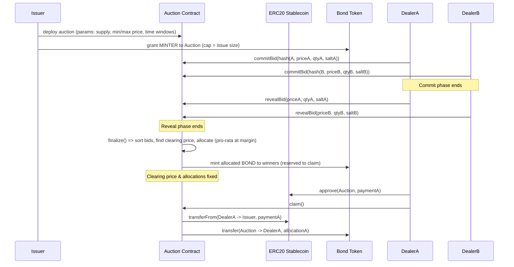

# Auctions

This project demonstrates an MVP bid contract where participants can bid on an auction contract. Once the auction concludes, the winner is allocated tokens.

It is built on Coinbase base (https://www.base.org/).

